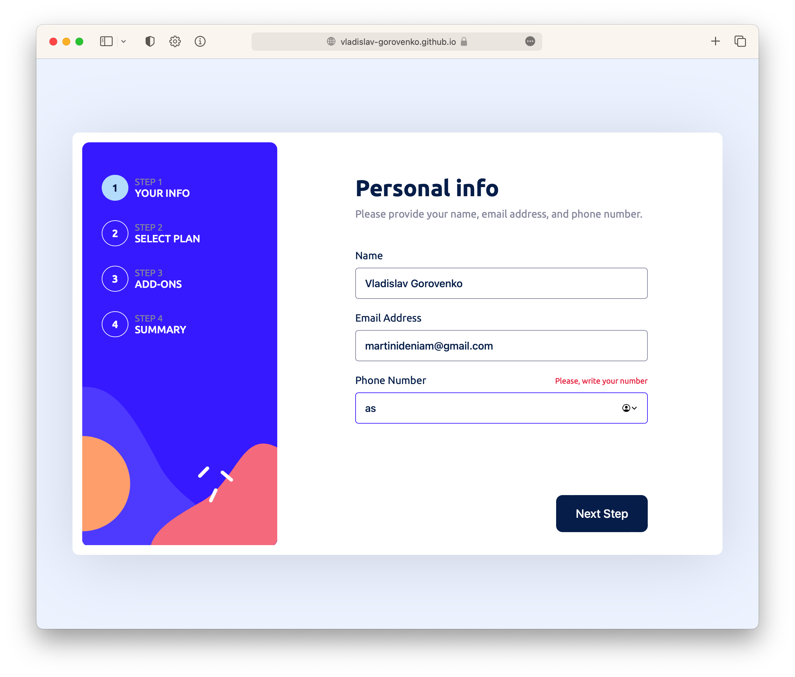
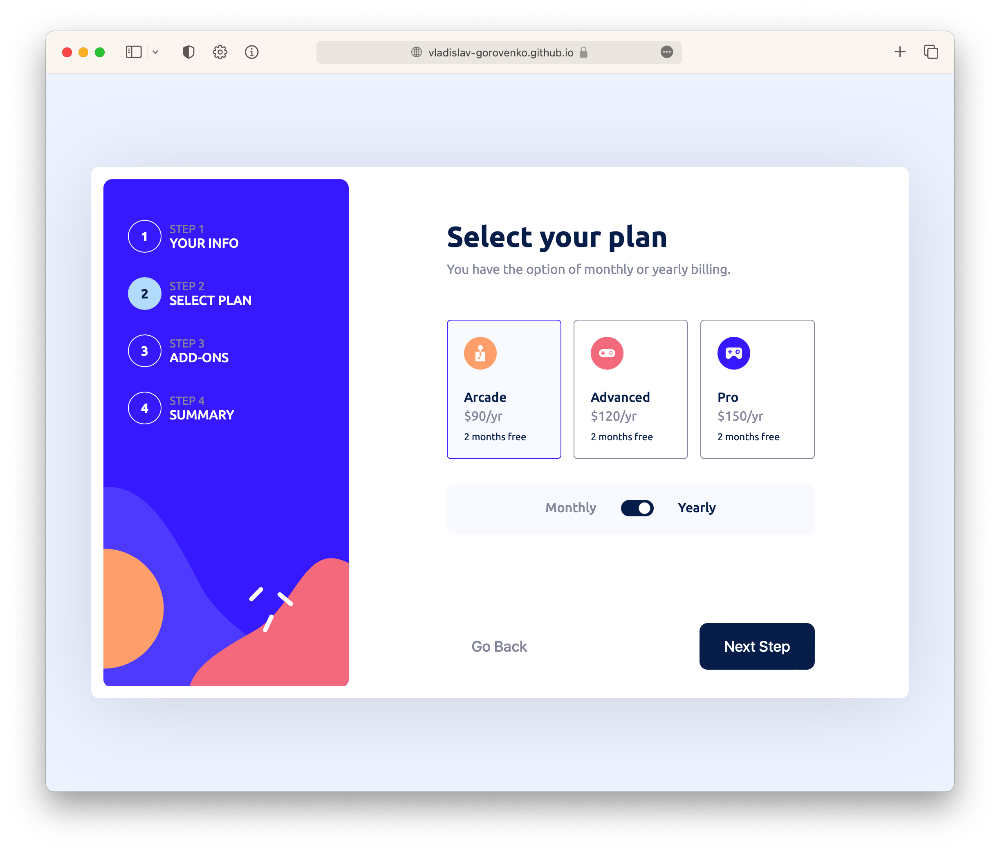
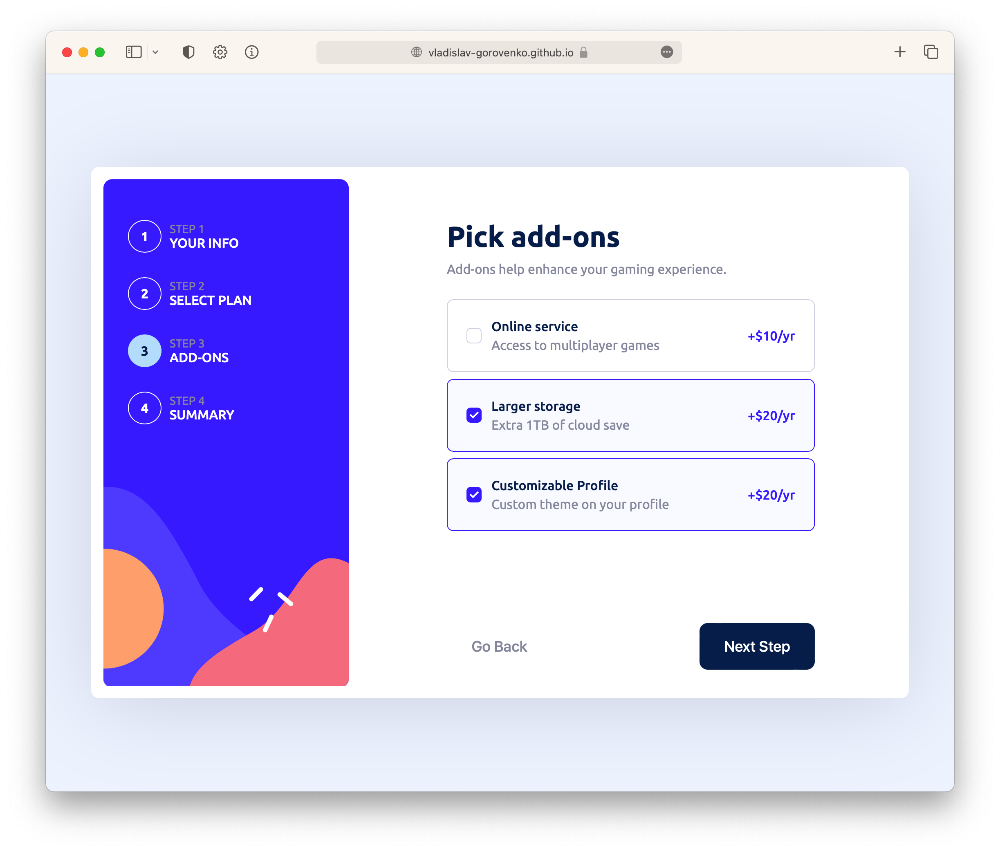
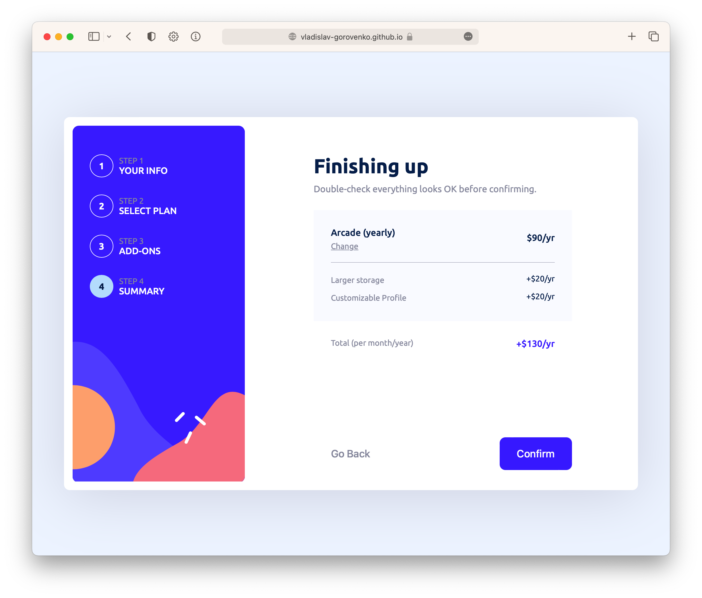
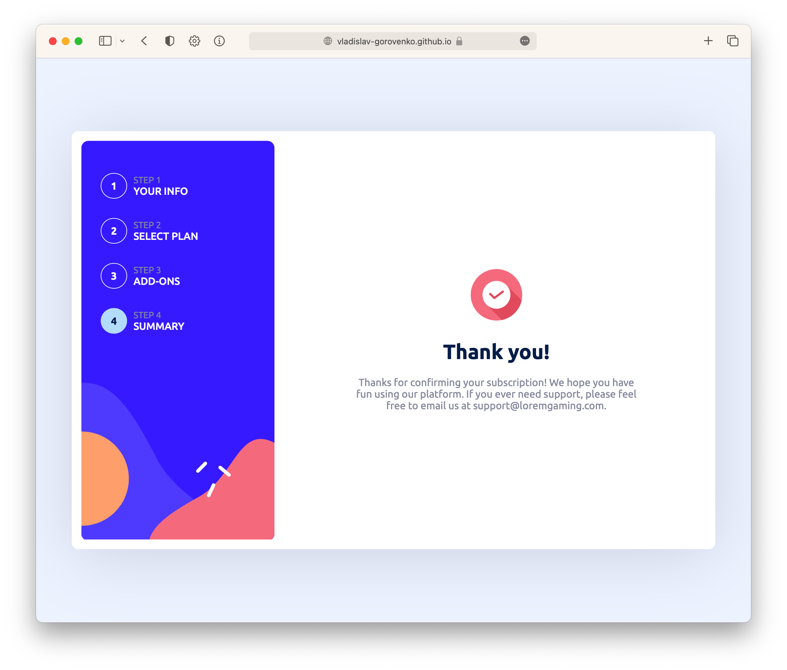

## Live

You can check out the live version of the project here -> [https://vladislav-gorovenko.github.io/challenge-7-multi-step-form/](https://vladislav-gorovenko.github.io/challenge-7-multi-step-form/).

# Multi Step Form Web App

Welcome to my Multi Step Form Web App repository. This project is a solution to the Multi Step Form Web App challenge on [Frontend Mentor](https://www.frontendmentor.io).

## The Challenge

The challenge involved building an application that allowed users to:

- Complete each step of the sequence
- See a summary of their selections on the final step and confirm their order
- View the optimal layout for the interface depending on their device's screen size
- See hover and focus states for all interactive elements on the page

## Technologies Used

This project was built using the following technologies:

- HTML
- CSS
- JS

## Screenshots

## Contact Me

For any inquiries or feedback, feel free to get in touch with me through:

- [GitHub](https://github.com/vladislav-gorovenko)
- [LinkedIn](https://www.linkedin.com/in/vladislav-gorovenko-web/)
- [FrontendMentor](https://www.frontendmentor.io/profile/martinideniam/)
- [Telegram](https://t.me/vlad_webdev_iam)

## Feedback

If you have any feedback or suggestions, please open an issue here on [GitHub](https://github.com/vladislav-gorovenko/challenge-7-multi-step-form/issues).
